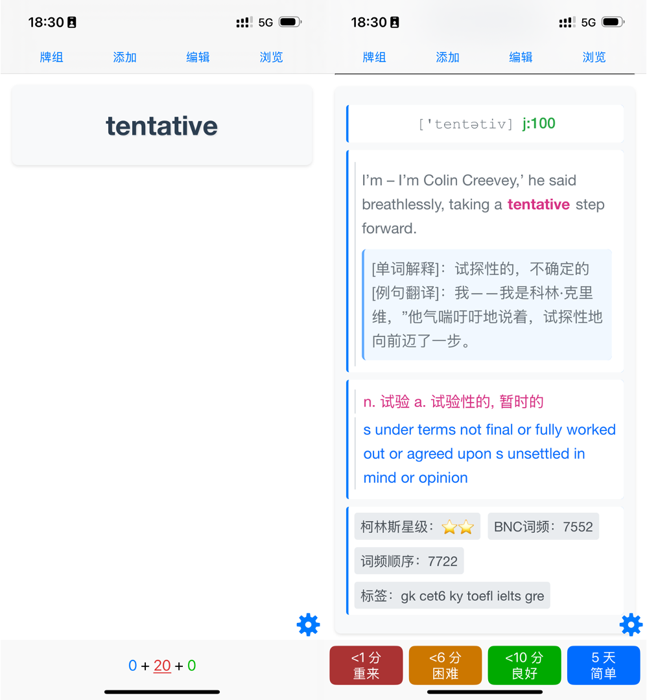

# Kindle词汇本转Anki工具

这个Python工具可以将Kindle生词本转换为Anki可导入的CSV格式，并自动添加详细的中英文释义、音标、词频等信息.

## 功能特点 ✨

- 📚 自动提取Kindle生词本，包含完整的原句上下文
- 🔍 智能识别和高亮显示原句中的目标单词
- 📖 自动查询ECDICT词典，获取全面的单词信息：
  - 📝 音标和词性标注
  - 🈺 中英文双语释义
  - 📊 词频信息（柯林斯星级、牛津核心词等）
  - 🔄 词形变化（时态、单复数等）
  - 💡 补充信息和例句
- 🎨 美观的 Anki 卡牌样式

## 使用效果

## 准备工作 📝

### 1. 获取Kindle生词本数据库

kindle 设备生词本一般路径：
```
system/vocabulary/vocab.db
```

将`vocab.db`复制到工具所在目录即可。

### 2. 获取ECDICT词典数据库

1. 访问 [ECDICT项目发布页](https://github.com/skywind3000/ECDICT/releases)
2. 下载最新版本的`ecdict-sqlite-28.zip`
3. 解压得到`stardict.db`文件
4. 将`stardict.db`放到工具所在目录

## 安装和使用

### 安装依赖
```bash
# 安装所需的Python包
pip install tqdm        # 进度条显示
pip install pandas      # 数据处理
```


### 基本用法
```bash
# 使用默认配置（自动查找当前目录下的vocab.db和stardict.db）
python kindle_words_extractor.py

# 指定数据库文件路径
python kindle_words_extractor.py /path/to/vocab.db /path/to/stardict.db

# 限制处理词数
python kindle_words_extractor.py -l 100

# 指定输出文件
python kindle_words_extractor.py -o mywords.csv

# 查看帮助
python kindle_words_extractor.py -h
```

## 输出格式 📋

生成的CSV文件包含两列：

### 单词信息
- 单词本身
- 原句上下文（自动高亮目标单词）

### 词典释义
1. 发音与词性
   - 音标
   - 词性标注：
     * n: 名词 (noun)
     * v: 动词 (verb)
     * j: 形容词 (adjective)
     * r: 副词 (adverb)
     * t: 介词 (preposition)
     * c: 连词 (conjunction)
     * i: 感叹词 (interjection)
     * u: 其他 (other)
     
   词性组合示例（数字表示概率）：
     * n:4/v:96: 4%概率作名词，96%概率作动词
     * j:88/n:12: 88%概率作形容词，12%概率作名词
     * i:66/r:34: 66%概率作感叹词，34%概率作副词
     * a:99/t:1: 99%概率作形容词，1%概率作介词

2. 释义
   - 中文释义：按照使用频率排序的中文含义
   - 英文释义：对应的英文解释
   
3. 词频信息
   - 柯林斯星级（collins）：范围为1-5，数字越大表示词汇越常用
     * 5：最常用词汇（如 the, be, of, and 等）
     * 4：常用词汇
     * 3：一般常用词汇
     * 2：较少用词汇
     * 1：不常用词汇
   - 牛津核心词标记（oxford）：
     * 1：表示属于牛津3000核心词汇
     * 0：表示不属于牛津核心词汇
   - BNC词频（bnc）：数值范围0-48851
     * 0：未收录在BNC语料库中
     * 1-100：最高频词汇
     * 101-1000：高频词汇
     * 1001-5000：中频词汇
     * 5000以上：低频词汇
     注：数字越小表示在英国国家语料库中出现频率越高
   - 词频顺序（frq）：数值范围0-46467
     * 0：未统计词频
     * 1-100：最常用词（如 the, be, to, of 等）
     * 101-1000：常用词
     * 1001-5000：较常用词
     * 5000以上：不常用词
     注：数字越小表示使用频率越高
   - 词类标签（tag）：
     * zk：中考词汇
     * gk：高考词汇
     * cet4：大学英语四级词汇
     * cet6：大学英语六级词汇
     * ky：考研词汇
     * toefl：托福词汇
     * ielts：雅思词汇
     * gre：GRE词汇

4. 词形变化
   - 时态变化：
     * 动词过去式：played, went
     * 过去分词：played, gone
     * 现在分词：playing, going
     * 第三人称单数：plays, goes
   - 名词单复数形式：
     * 规则变化：book→books
     * 不规则变化：child→children
   - 形容词比较级和最高级：
     * 规则变化：tall→taller→tallest
     * 不规则变化：good→better→best


注：词典数据来源于ECDICT（Free English-Chinese Dictionary Database），包含超过300万个英文单词和词组，提供全面的英语学习参考信息。

## Anki导入步骤 📥

1. 打开Anki
2. 点击"文件" → "导入"
3. 选择生成的CSV文件
4. 导入设置：
   - 分隔符类型：逗号
   - 字段对应：
     - 第1列 → 单词信息（正面）
     - 第2列 → 词典释义（背面）
   - 允许HTML：是
   - 更新现有记录：是
5. 确认导入

## 注意事项 ⚠️

- 确保Python版本 ≥ 3.6
- 定期备份Kindle的vocab.db文件
- CSV文件使用UTF-8编码
- 首次运行可能需要建立数据库索引，请耐心等待
- 建议定期更新ECDICT词典数据库以获取最新内容

## 常见问题 ❓

Q: 找不到vocab.db文件？  
A: 请确保您的Kindle已经同步，并有查词记录。不同设备的文件位置可能略有不同，请参考上方路径说明。

Q: 词典释义不完整？  
A: 请确保下载的是完整版的ECDICT词典数据库，并且文件未被损坏。

Q: 如何自定义样式？  
A: 可以修改代码中的CSS样式部分，支持自定义颜色、字体、布局等。

Q: 处理速度较慢？  
A: 首次运行时会建立数据库索引，后续运行会更快。也可以使用`-l`参数限制处理词数。

